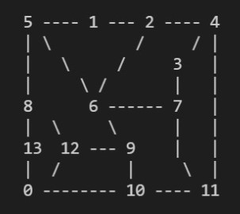
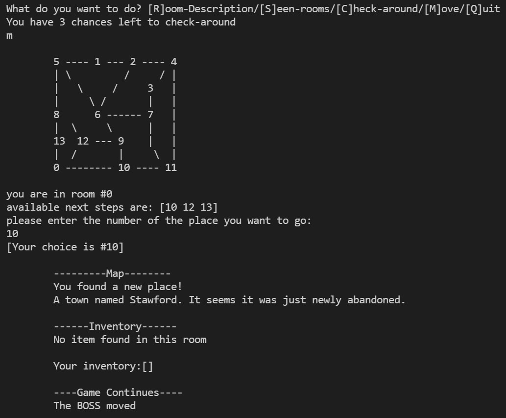
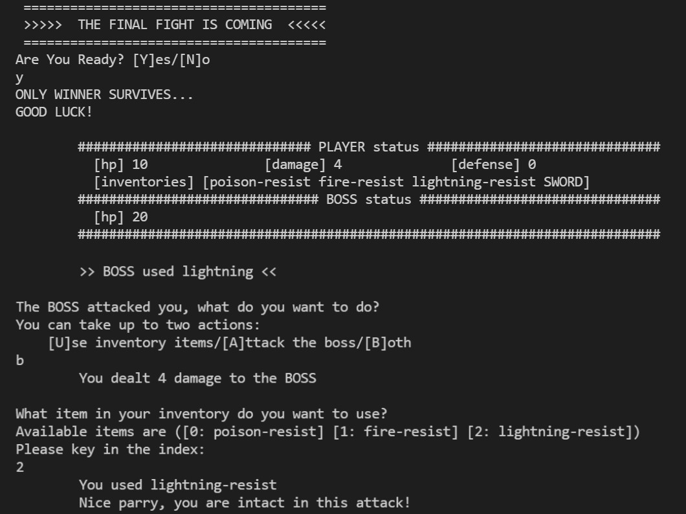

# Text Adventure Game

## Goal
  - collect items in the maze and kill the boss
  - avoid the boss before you are strong enough to fight it

## Maze
  - the maze consists of 14 rooms in total
  - the player will start at room 0
  

## Play
  - run [src\adventure\core.clj](src\adventure\core.clj) by using command `clj -M core.clj`

  

## Spoilers
  - Player and Boss
    - Player default stat
      - hp: 10
      - defense: 0
      - damage: 2
    - Boss default stat
      - hp: 20
      - defense: 0
      - normal attack damage: 2
      - fire attack damage: 6
      - lightning attack damage: 4
      - poison attack damage: 8

  - Items
    - items will be placed randomly into some of the rooms
    - there are total of 5 items available in the maze
      - armor: build player's damage
      - sword: build player's damage
      - fire-resist: to be used in fight
      - lightning-resist: to be used in fight
      - poison-resist: to be used in fight
